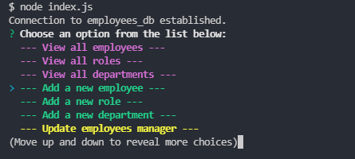
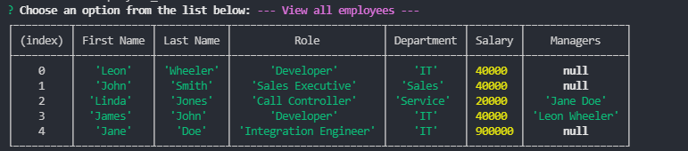

# Employee Tracker

## Description

The Employee Tracker uses Node.js, Inquirer.js, and MYSQL to allow users to keep a track of employees and their roles, departments, and salaries. They are able to add, update, and delete employees, roles, and departments. Once the app has started and an option is selected, a query will be sent to the MYSQL database to perform the chosen action.

## Table of Contents

- [Employee Tracker](#employee-tracker)
  - [Description](#description)
  - [Table of Contents](#table-of-contents)
  - [Installation](#installation)
  - [Usage](#usage)
  - [Screenshots](#screenshots)
  - [Tech/framework used](#techframework-used)
  - [Features](#features)
  - [Scripts](#scripts)
  - [Tests](#tests)
  - [Contact](#contact)

## Installation

```
npm install
```

## Usage

Run 'node index.js' or 'npm run start'.

## Screenshots

Some available options:  


View all employees:


## Tech/framework used

<b>Built with</b>

- [Node.js](https://nodejs.org/en/)
- [Inquirer.js](https://www.npmjs.com/package/inquirer)
- [MYSQL](https://www.mysql.com/)

## Features

- View all employees, roles, or departments.
- Add new employees, roles, or departments.
- Delete employees, roles, or departments.
- Update employees manager or role.

## Scripts

You can use the below scripts to run the app without or with nodemon:

```
npm start
npm dev
```

## Tests

N/A

## Contact

For any issues, please contact [my email](mailto:leonwheeler08@gmail.com) 😀
